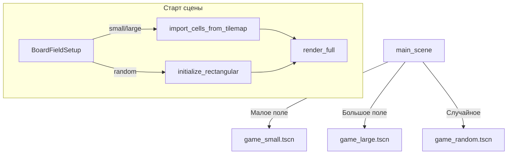

# Полировка геймплея, камера, музыка и меню

## Решения по уточнениям (от вас)

| Тема | Решение |
|------|---------|
| Музыка | **Везде** (меню + игра), один непрерывный shuffle-плейлист между сменами сцен |
| Pan на ПК | **Зажатая ЛКМ + перетаскивание**; отпускание после drag **не** считается кликом по клетке |
| Старт поля | **Три кнопки в главном меню** → три игровые сцены (не один `BoardRandomizer` вручную) |

---

## Контекст

Цепочка хода: [`scenes/game/game.gd`](scenes/game/game.gd) → [`transition_player.gd`](scenes/game/transition_player.gd) → [`cell_fx`](widgets/cell_fx/).

Известные баги: частицы без texture / короткий lifetime / `fx.visible = false` раньше времени; `BoardModel._ready()` перетирает `tile_map_data`; меню — одна кнопка «Новая игра».

---

## 1) Анимация «взрыва» клетки

**Файлы:** [`widgets/cell_fx/cell_fx.gd`](widgets/cell_fx/cell_fx.gd), [`widgets/cell_fx/cell_fx.tscn`](widgets/cell_fx/cell_fx.tscn), [`transition_player.gd`](scenes/game/transition_player.gd).

**Последовательность `play_flip`:** shake + плавный рост scale до ~1.25–1.35 → смена текстуры + `on_flipped` → burst частиц + scale вниз до 1.0 → `await` полный `lifetime` частиц → `finished`.

**Частицы:** texture, `z_index` > sprite, `lifetime` 0.9–1.4, `gravity` 400–900 вниз, `amount` 16–24; не скрывать FX-узел до конца эмиссии.

---

## 2) Три игровые сцены и раскладка поля

Вместо опционального узла `BoardRandomizer` в одной сцене — **три варианта** с общим [`game.gd`](scenes/game/game.gd):

| Сцена | Назначение | Старт поля |
|-------|------------|------------|
| [`scenes/game/game_small.tscn`](scenes/game/game_small.tscn) | Помещается на экран | Импорт из нарисованного `tile_map_data` (как в редакторе) |
| [`scenes/game/game_large.tscn`](scenes/game/game_large.tscn) | Больше экрана — демо pan/zoom | Импорт из редактора (крупная сетка, напр. ~12×18) |
| [`scenes/game/game_random.tscn`](scenes/game/game_random.tscn) | Помещается, каждый раз новое | `BoardModel.initialize_rectangular(rows, columns, color_count)` |

**Текущий** [`game.tscn`](scenes/game/game.tscn) (UID `uid://c44eua7bbldcb`): станет **`game_small.tscn`**, UID **сохранить** для обратной совместимости; при необходимости тонкий alias не нужен — main переведём на явные UID/пути трёх сцен.

**Новые файлы:**

- [`scenes/game/board_field_setup.gd`](scenes/game/board_field_setup.gd) — `apply(model, view, mode: enum { IMPORT, RANDOM })`.
- [`scenes/game/board_view_tilemap.gd`](scenes/game/board_view_tilemap.gd) — `import_cells_to_model(model)`.
- [`board_model.gd`](scenes/game/board_model.gd) — убрать runtime auto-init в `_ready()` (preview в редакторе — только через `BoardView`).

**В каждой сцене:** узел `BoardFieldSetup` с `@export var setup_mode` или отдельный скрипт-сцена с константой; `game.gd` в `_ready()` вызывает setup до `render_full`.

**Редактор:** малое и большое поле **рисуются вручную** в `BoardView` каждой сцены; random-сцена — размер сетки через export `rows/columns` на `BoardModel` (без обязательной раскраски в tilemap).

---

## 3) Pan / zoom (без плагина)

**Файл:** [`scenes/game/board_camera_controller.gd`](scenes/game/board_camera_controller.gd) + `Camera2D` в каждой игровой сцене.

| Платформа | Pan | Zoom | Выбор клетки |
|-----------|-----|------|----------------|
| **ПК** | **ЛКМ зажата + drag** | Колесо | **Короткий ЛКМ без смещения** (tap-click) |
| **Touch** | Drag 2-м пальцем | Pinch | 1 палец tap |

**Разделение клик / drag (ПК):** в [`input_controller.gd`](scenes/game/input_controller.gd) + камера:

- При `InputEventMouseButton` press (ЛКМ) — запомнить позицию, `dragging = false`.
- На `InputEventMouseMotion` с зажатой ЛКМ: если `distance > drag_threshold` (≈8–12 px) → `dragging = true`, камера pan, **подавить** будущий клик.
- На release ЛКМ: если **не** `dragging` → `cell_selected`; иначе только завершить pan.

`BoardCameraController.is_suppressing_click()` — для проверки на release.

Touch: однопальцевый drag **не** pan (только tap); pan — `ScreenDrag` с `index >= 1` или pinch.

**Сброс вида (опционально):** двойной tap по пустому месту или кнопка в HUD — к дефолтному zoom/position сцены.

---

## 4) Музыка (`res://sounds/`)

- Autoload [`autoload/music_manager.gd`](autoload/music_manager.gd) в [`project.godot`](project.godot).
- Скан `*.wav`, shuffle, `AudioStreamPlayer` на шине **Music**.
- Старт при запуске приложения; **не останавливать** при `change_scene` (main ↔ game).
- `set_music_volume(0..1)` + `user://settings.cfg`.

---

## 5) Главное меню

**Кнопки запуска:**

- «Малое поле» → `game_small.tscn`
- «Большое поле» → `game_large.tscn`
- «Случайное поле» → `game_random.tscn`

**Дополнительно:**

- [`uis/main_settings/`](uis/main_settings/) — ползунок громкости музыки.
- [`uis/main_about/`](uis/main_about/) — текст об игре, заглушка автора, `LinkButton` → `OS.shell_open("https://example.com")`.

Обновить [`main_scene.tscn`](scenes/main/main_scene.tscn) + [`main_scene.gd`](scenes/main/main_scene.gd).

---

## 6) Проверка

- Три режима из меню: small/large/random ведут себя как задумано.
- Large: без pan поле не обзорно; с ЛКМ-drag и колесом — ок.
- После drag ЛКМ клетка **не** активируется.
- Random: каждый «Играть снова» — новая раскладка.
- Музыка непрерывна menu↔game; громкость сохраняется.
- Анимация взрыва + частицы вниз видны.

---

## Ограничения

- Без плагинов/addons.
- Не трогать `.godot/`.
- `BoardField` scale не рефакторить.
