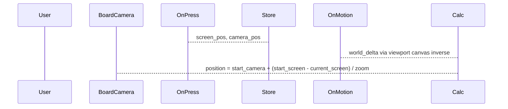

# Доработки UX после полировки геймплея

## Решения по уточнениям

| Тема | Решение |
|------|---------|
| Большое поле | **IMPORT** из `tile_map_data`, нарисованного в редакторе в [`game_large.tscn`](scenes/game/game_large.tscn) (не random) |
| Бургер во время анимации | **Разрешён** в любой момент, в т.ч. во время волны |

---

## 1) Большое поле — крупнее, без «ужимания» камерой

**Сейчас:** [`game_large.tscn`](scenes/game/game_large.tscn) — `setup_mode = RANDOM`, `rows=14`, `columns=10`, `BoardCamera.zoom = (0.45, 0.45)`.

**Сделать:**
- **`BoardFieldSetup.setup_mode = IMPORT_FROM_TILEMAP`** (0).
- **Нарисовать крупную сетку** в `BoardView` в редакторе (целевой ориентир ~18–24 по ширине/высоте — по ощущениям «не влезает на экран»); `rows`/`columns` на `BoardModel` задаёт `import_cells_to_model()` по bbox.
- **`BoardCamera.zoom = Vector2(1, 1)`** — без fit-to-screen через zoom.
- `BoardField.scale` **не менять**; обзор — pan/zoom игрока.

При реализации: если в `tile_map_data` пока заготовка 6×9 — расширить программно минимальный шаблон **или** оставить пустым с комментарием в сцене; финальная раскладка — из редактора (вы рисуете сами).

---

## 2) Pan камеры — «прилипание» к точке под курсором

**Причина:** в [`board_camera_controller.gd`](scenes/game/board_camera_controller.gd) `_pan_camera` делает `position += -relative / zoom`, что при `emulate_touch_from_mouse` и stretch viewport даёт неверный масштаб дельты; нет **grab-anchor** при старте drag.

**Сделать в** [`board_camera_controller.gd`](scenes/game/board_camera_controller.gd):

- При начале drag (мышь / 1-й палец после порога): сохранить `_drag_camera_start`, `_drag_screen_start`.
- На motion:  
  `var delta_screen := _drag_screen_start - event.position`  
  `_camera.position = _drag_camera_start + delta_screen / _camera.zoom`  
  (для touch — обновлять `_drag_screen_start` по желанию или использовать накопленный `event.position` от press).
- Альтернатива/дополнение: переводить `event.relative` через `get_viewport().get_canvas_transform().affine_inverse().basis_xform(relative)`.
- Экспорт `board_field_path` **не нужен** — pan идёт в мировых координатах камеры; масштаб `BoardField` уже учтён в world space.

Проверить оба пути: **MouseMotion + ЛКМ** и **ScreenDrag** (при `emulate_touch_from_mouse`).

---

## 3) Частицы — больше, крупнее, белые/жёлтые, медленнее

**Файлы:** [`widgets/cell_fx/cell_fx.tscn`](widgets/cell_fx/cell_fx.tscn), опционально [`widgets/cell_fx/cell_fx.gd`](widgets/cell_fx/cell_fx.gd) (`particle_lifetime` export).

| Параметр | Было | Цель |
|----------|------|------|
| `amount` | 20 | **36–48** |
| `lifetime` | 1.1 | **1.5–1.8** |
| `initial_velocity` | 90–160 | **35–70** (медленнее) |
| `gravity.y` | 650 | **500–700** (сохранить падение вниз) |
| `scale_min/max` | 0.6–1.2 | **1.5–3.0** |
| Цвет | одна текстура тайла | **белые + жёлтые**: `color`/`color_ramp` в `ParticleProcessMaterial` или две текстуры 8×8 (белый/жёлтый с alpha) в `assets/` |

- В материале: `color = Color(1,1,1,0.85)` + `hue_variation` / второй burst с жёлтым оттенком, либо `scale_amount_curve` + прозрачность к концу жизни.
- «Исчезают за экраном» — достаточно **увеличенного `lifetime`** + гравитации вниз (отдельный cull не обязателен в v1).

Обновить `_estimate_wave_duration_sec` в [`transition_player.gd`](scenes/game/transition_player.gd) под новый `lifetime`.

---

## 4) Главное меню — одинаковый размер кнопок

**Файл:** [`scenes/main/main_scene.tscn`](scenes/main/main_scene.tscn)

- Убрать `size_flags_vertical = 3` (EXPAND_FILL) у `SmallButton`, `LargeButton`, `RandomButton` — из‑за него они растягиваются на весь VBox.
- Задать всем 5 кнопкам одинаково, например: `custom_minimum_size = Vector2(0, 72)`, `theme_override_font_sizes/font_size = 36`.
- Удалить instanced оверлеи `MainSettingsPanel` / `MainAboutPanel` из сцены.

**Файл:** [`scenes/main/main_scene.gd`](scenes/main/main_scene.gd) — переходы `change_scene_to_file` на новые сцены настроек/об игре.

---

## 5) Настройки и «Об игре» — отдельные сцены со стрелкой «назад»

**Новые сцены** (по архитектуре `scenes/`):

- [`scenes/settings/settings_scene.tscn`](scenes/settings/settings_scene.tscn) + [`settings_scene.gd`](scenes/settings/settings_scene.gd)
- [`scenes/about/about_scene.tscn`](scenes/about/about_scene.tscn) + [`about_scene.gd`](scenes/about/about_scene.gd)

**Шаблон UI:**
- `Control` full rect
- Верх: `HBox` с **кнопкой «←»** (или `TextureButton`) → `get_tree().change_scene_to_file(MAIN_SCENE_UID)`
- Контент: из текущих [`uis/main_settings/main_settings_panel.tscn`](uis/main_settings/main_settings_panel.tscn) / [`uis/main_about/main_about_panel.tscn`](uis/main_about/main_about_panel.tscn) (логику слайдера/ссылки перенести, Dim/Panel-обёртку убрать).

Старые overlay-панели в `uis/main_*` можно удалить или оставить неиспользуемыми — предпочтительно **удалить** после переноса.

---

## 6) Бургер-меню в игре

**Новое:** [`uis/game_pause_menu/game_pause_menu.tscn`](uis/game_pause_menu/game_pause_menu.tscn) + `.gd` (`CanvasLayer`, `mouse_filter` STOP на панели).

- Кнопка **☰** (правый верхний угол, поверх HUD, `mouse_filter` не IGNORE).
- По нажатию — панель:
  - **«Начать заново»** — в [`game.gd`](scenes/game/game.gd): `board_field_setup.apply(...)`, `game_session_state.start_new_game(...)`, `board_view.render_full(...)`, скрыть pause UI, `phase = IDLE`.
  - **«В главное меню»** — `change_scene_to_file(MAIN_SCENE_UID)` (музыка autoload не трогаем).

Подключить instanced `GamePauseMenu` во **всех трёх** игровых сценах (`game_small`, `game_large`, `game_random`, [`game.tscn`](scenes/game/game.tscn)).

**Доступность:** бургер открывается **всегда** (включая `ANIMATING` и при открытом `GameOverUI`). «Начать заново» при активной анимации — прервать/сбросить сессию и пересобрать поле (при необходимости `transition_player` / `phase` сбросить в `IDLE`).

---

## Порядок работ

1. `board_camera_controller` (pan fix)  
2. `game_large` размер + zoom  
3. `cell_fx` частицы  
4. `main_scene` кнопки + сцены settings/about  
5. `game_pause_menu` + `game.gd` restart  
6. Ручной smoke: large pan, меню, restart, настройки

## Не входит в scope

- Вынос `BoardField.scale` в 1.0 (глобальный рефакторинг).
- Отдельный particle cull по `VisibleOnScreenNotifier2D`.
