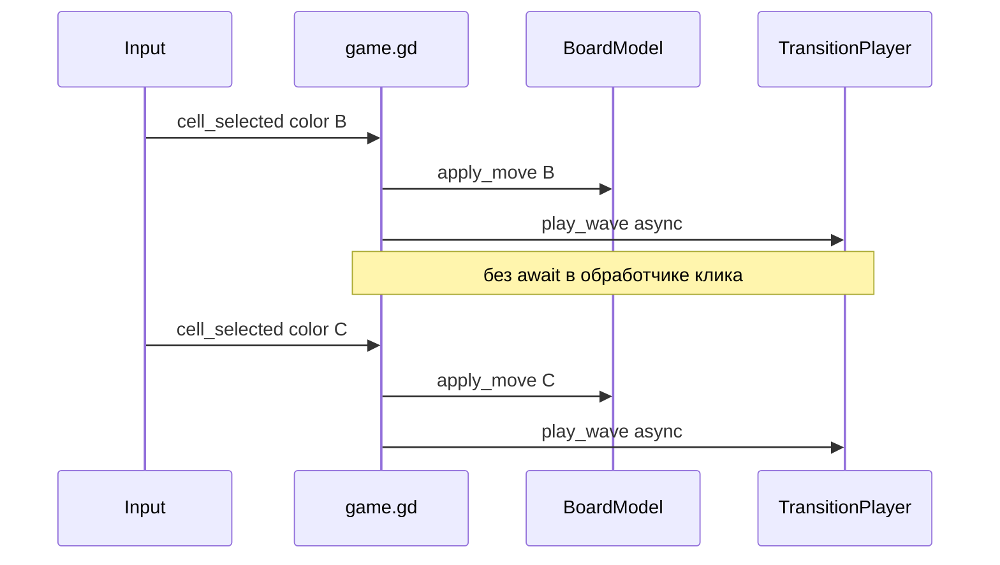

# Параллельные ходы, 12×12, boot и реорганизация

## Контекст

| Проблема | Причина |
|---------|---------|
| Клик во время волны блокируется | [`game.gd`](scenes/game/game.gd) `phase != IDLE`, [`move_validator.gd`](scenes/game/move_validator.gd) `session.is_animating` |
| Малое ≈ большое | [`game_large.tscn`](scenes/game/game_large.tscn) скопирован с тем же `tile_map_data` 6×9; bootstrap 16×22 срабатывает только если tilemap **пустой** |
| Нет заставки | `run/main_scene` сразу [`main_scene`](scenes/main/main_scene.tscn); музыка уже в autoload |
| «Помойка» в `scenes/game/` | 12+ `.gd` в одной папке с 4 `.tscn` |

По вашему выбору: **вся логика в `widgets/`**, в [`scenes/game/`](scenes/game/) — только оркестратор и корневые варианты сцен (`game_small` / `game_large` / `game_random`).

---

## 1) Параллельные волны при новом клике



**Изменения:**

- [`game.gd`](scenes/game/game.gd): убрать блок `phase == ANIMATING`; блокировать только `GAME_OVER` (и при необходимости открытое меню победы). `_on_cell_selected` вызывает `_process_move(color)` **без `await`** (fire-and-forget).
- [`move_validator.gd`](scenes/game/move_validator.gd) → перенос в `widgets/`: убрать проверку `session.is_animating`.
- [`game_session_state.gd`](scenes/game/game_session_state.gd): `is_animating` не использовать как блокировку хода (можно оставить для HUD «Переход...» через счётчик волн).
- [`transition_player.gd`](scenes/game/transition_player.gd): счётчик `_active_waves`; `started`/`finished` и синхронизация с `game.gd` через **refcount** (`_wave_count`), а не один глобальный `phase = ANIMATING`.
- [`game.gd`](scenes/game/game.gd): упростить `Phase` до `IDLE` / `GAME_OVER` или держать `ANIMATING` только для HUD по `wave_count > 0`.
- Пул [`cell_fx_pool`](widgets/cell_fx/cell_fx_pool.gd): при необходимости увеличить `pool_size` (например 96) для нескольких одновременных волн.

Модель уже обновляется в `apply_move` до анимации — параллельные ходы корректны для Flood It.

---

## 2) Большое поле 12×12, малое отдельно

| Сцена | Раскладка |
|-------|-----------|
| [`game_small.tscn`](scenes/game/game_small.tscn) | `IMPORT`, **без** bootstrap — раскладка из нарисованного `tile_map_data` (~6×9) |
| [`game_large.tscn`](scenes/game/game_large.tscn) | `IMPORT` + **`bootstrap_columns = 12`**, **`bootstrap_rows = 12`**; **очистить** унаследованный `tile_map_data` (пустой слой), чтобы bootstrap всегда строил 12×12 |
| [`game_random.tscn`](scenes/game/game_random.tscn) | `RANDOM`, компактный размер (6×9) без изменений |

- [`board_field_setup.gd`](scenes/game/board_field_setup.gd) → `widgets/board/board_field_setup.gd`: опционально `@export var always_bootstrap_size: bool` для large — при `true` всегда `fill_random_grid(12, 12)` перед import (гарантия размера даже если в редакторе что-то нарисуют).

- [`game.tscn`](scenes/game/game.tscn): удалить дубликат или оставить thin alias на `game_small` (UID `c44eua7bbldcb` оставить на `game_small.tscn`).

Проверка: из меню «Большое поле» — сетка **12×12**, «Малое» — прежний компактный вид.

---

## 3) Анимированный старт приложения

Новая сцена [`scenes/boot/boot_scene.tscn`](scenes/boot/boot_scene.tscn) + [`boot_scene.gd`](scenes/boot/boot_scene.gd).

**Таймлайн (3 с):**
1. Полноэкранный чёрный `ColorRect` (`modulate.a = 1`).
2. **0 с** — музыка уже стартует через autoload [`MusicManager`](autoload/music_manager.gd) (при необходимости `ensure_playing()` в boot).
3. **1.5 с** — удержание затемнения.
4. **1.5 с** — `Tween` fade `modulate.a` 1 → 0 на оверлее; под ним заранее подгружен или в конце `change_scene_to_file` на main.

**Рекомендуемый поток:** после 1.5 с инстанцировать [`main_scene`](scenes/main/main_scene.tscn) как дочерний узел, затем fade оверлея — плавное появление меню без «мигания» смены сцены.

**[`project.godot`](project.godot):** `run/main_scene` → `res://scenes/boot/boot_scene.tscn`.

---

## 4) Реорганизация: widgets + тонкий scenes/game

Целевая структура:

```
widgets/
  board/           board_model.gd, board_view_tilemap.gd, board_field_setup.gd
  game_session/    game_session_state.gd
  game_input/      input_controller.gd, board_camera_controller.gd
  game_rules/      move_validator.gd
  game_transition/ transition_player.gd, wave_layer_runner.gd
  game_hud/        hud_controller.gd
  cell_fx/         (как есть)

scenes/game/
  game.gd              # только оркестрация
  game_small.tscn
  game_large.tscn
  game_random.tscn

scenes/boot/
  boot_scene.tscn
  boot_scene.gd
```

**Шаги миграции:**
1. Переместить `.gd` в подпапки `widgets/*` (Godot пересоздаст `.uid` при открытии проекта).
2. Обновить `ext_resource path=` во всех `game_*.tscn`, preload в `transition_player`, [`architecture.mdc`](.cursor/rules/architecture.mdc).
3. Удалить старые файлы из корня `scenes/game/` (кроме `game.gd` и `.tscn`).
4. Preload-пути: `res://widgets/game_transition/wave_layer_runner.gd` и т.д.

Корневая сцена при игре — один из `game_*.tscn`; `game.gd` остаётся единственной «сценовой» логикой в `scenes/game/`.

---

## 5) Проверка

- Во время волны второй клик запускает вторую волну; счётчик ходов растёт; HUD не зависает.
- Малое / большое / случайное — разные размеры; large = 12×12.
- Запуск приложения: 1.5 с чёрный экран + музыка, 1.5 с fade → главное меню.
- Проект открывается без битых путей; grep по `res://scenes/game/board_` пустой (кроме `game.gd`).

---

## Не входит в scope

- Отмена/слияние пересекающихся волн на одной клетке.
- Отдельный intro только при первом запуске (каждый старт — как описано).
