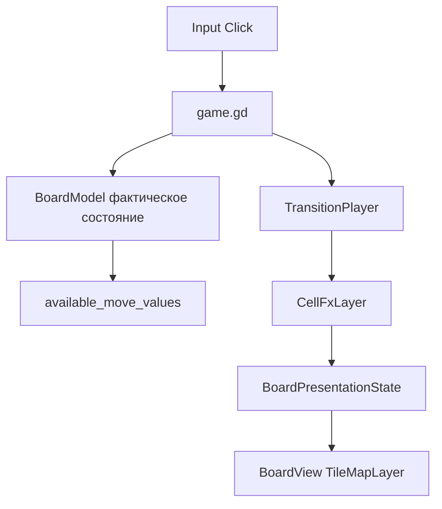

# План: Визуальное Состояние Волн

## Идея

Текущая проблема в смешении ролей: `BoardModel` уже содержит фактическое состояние игры после всех ходов, а `TileMapLayer` используется как текущее видимое состояние. Для параллельных волн нужен третий слой — состояние презентации.



## Разделение Ответственности

- `widgets/board/board_model.gd`
  - хранит фактическое состояние игры `cells`;
  - `apply_move()` обновляет модель сразу;
  - `available_move_values` считается от фактического состояния, как будто все волны уже завершены.

- `widgets/board/board_presentation_state.gd` (новый компонент)
  - хранит визуально применённое состояние ячеек;
  - синхронизируется с `BoardView` при старте/рестарте;
  - принимает запросы `request_cell_commit(wave_id, coord, value)` от FX;
  - применяет значения на `TileMapLayer` в правильном порядке.

- `widgets/cell_fx/cell_fx_layer.gd`
  - слой конкретной волны: пул FX, `wave_id`, `busy`;
  - не решает порядок записи в `TileMapLayer`.

- `widgets/game_transition/transition_player.gd`
  - создаёт `WaveState`: `wave_id`, `move_result`, слой, jobs;
  - запускает до 3 волн параллельно;
  - в job передаёт не прямой `board_view.render_coord_value`, а callback в `BoardPresentationState`.

## Правило Поклеточного Применения

Для каждой ячейки может быть несколько завершившихся анимаций от разных волн. Применять нужно в порядке волн, а не просто “кто первый закончил”.

Пример:

```text
coord A:
  wave 1 -> value 3
  wave 2 -> value 5
```

Если FX wave 2 завершился раньше wave 1:

1. `BoardPresentationState` запоминает pending commit wave 2.
2. Когда завершается wave 1, применяется value 3.
3. После этого сразу применяется уже готовый pending value 5.

Так старая волна не перезапишет более новую.

## План Реализации

1. Добавить `widgets/board/board_presentation_state.gd`.
   - Поля:
     - `current_values: Dictionary[Vector2i, int]` — что уже визуально применено;
     - `last_applied_wave_by_coord: Dictionary[Vector2i, int]`;
     - `pending_commits_by_coord: Dictionary[Vector2i, Dictionary]`.
   - Методы:
     - `reset_from_model(board_model, board_view)`;
     - `request_cell_commit(wave_id, coord, value, board_view)`;
     - `_flush_coord_commits(coord, board_view)`;
     - `clear()`.

2. Обновить игровые сцены.
   - Добавить узел `BoardPresentationState` рядом с `BoardModel` / `BoardView`.
   - Подключить скрипт `widgets/board/board_presentation_state.gd`.

3. Обновить `scenes/game/game.gd`.
   - Добавить `@onready var board_presentation_state`.
   - После setup/restart вызывать `board_presentation_state.reset_from_model(board_model, board_view)`.
   - В `transition_player.play_wave(...)` передавать `board_presentation_state`.
   - `BoardModel` продолжает обновляться сразу, чтобы правила кликов работали от фактического финального состояния.

4. Обновить `widgets/game_transition/transition_player.gd`.
   - Хранить `presentation_state` в pending wave / wave state.
   - В jobs добавить `presentation_state`.
   - Убрать прямые fallback-записи в `board_view`, кроме аварийного случая без FX, где тоже использовать `presentation_state.request_cell_commit(...)`.

5. Обновить `widgets/game_transition/wave_cell_playback.gd`.
   - Стартовую текстуру брать из `BoardPresentationState.current_values`, а не из `BoardModel` и не из случайного текущего `TileMapLayer`.
   - Callback завершения FX: `presentation_state.request_cell_commit(wave_id, coord, new_value, board_view)`.

6. Обновить `widgets/cell_fx/cell_fx.gd`.
   - Оставить callback “по завершении FX”, но назвать его нейтрально, например `on_finished_apply`.
   - Убедиться, что callback вызывается всегда после ожидания частиц/твина, кроме `prepare_for_play()` при restart.

7. Проверка.
   - Первая волна не меняет все клетки сразу.
   - Вторая волна стартует до конца первой.
   - Базовый `TileMapLayer` не перескакивает в состояние “первая уже закончилась”.
   - Одна и та же клетка может получить FX от wave 1 и wave 2.
   - Если wave 2 завершилась раньше wave 1 на одной клетке, визуальное значение применяется только после wave 1, затем wave 2.
   - Restart очищает `BoardPresentationState`, очереди и FX слои.

## Важное Решение

`BoardPresentationState` должен быть единственным местом, которое применяет анимированные изменения в `BoardView`. `TransitionPlayer` и `CellFxLayer` только сообщают: “анимация такой волны для такой клетки завершилась”.