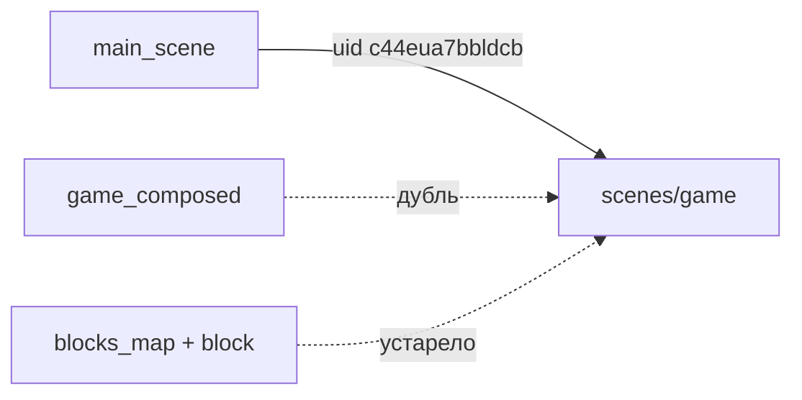

# Замена старой маппы на новую композицию

## Текущее состояние

- [`scenes/game/game.gd`](scenes/game/game.gd) уже переведён на новую архитектуру (`BoardModel`, `BoardView`, `TransitionPlayer`, `CellFxPool`, `GameOverUI`).
- [`scenes/game/game.tscn`](scenes/game/game.tscn) **не совпадает** со скриптом: всё ещё instancе `BlocksMapGame` и сигнал `_on_blocks_map_game_onclick` (сломанная сцена).
- Полная рабочая сцена сейчас в [`scenes/game_composed/game_composed.tscn`](scenes/game_composed/game_composed.tscn).
- [`scenes/main/main_scene.gd`](scenes/main/main_scene.gd) ведёт на `uid://c44eua7bbldcb` — **UID нужно сохранить** на игровой сцене.



## Целевая структура

```
scenes/game/
  game.tscn              # единственная игровая сцена (UID c44eua7bbldcb)
  game.gd                # оркестратор + GameOverUI
  board_model.gd
  board_view_tilemap.gd
  game_session_state.gd
  input_controller.gd
  move_validator.gd
  transition_player.gd
  hud_controller.gd
  wave_layer_runner.gd

widgets/cell_fx/          # остаётся (оверлей анимации)
```

## 1) Собрать каноническую `game.tscn`

- Пересобрать [`scenes/game/game.tscn`](scenes/game/game.tscn) по дереву из `game_composed`:
  - `Game` (Node2D) + [`game.gd`](scenes/game/game.gd)
  - `BoardModel`, `GameSessionState`, `BoardField/BoardView/CellFxPool`
  - `InputController`, `MoveValidator`, `TransitionPlayer`
  - `HUDController` (TurnsLabel, StatusLabel, `mouse_filter = IGNORE`)
  - `GameOverUI` (из [`uis/GameOverUI/game_over_ui.tscn`](uis/GameOverUI/game_over_ui.tscn)) — подключить сигналы `play_again`, `show_map`, `switch_to_main`
- **Сохранить** `uid://c44eua7bbldcb` у корневой сцены (не менять UID).
- Убрать: `BlocksMapGame`, старый `Label` ходов, кнопку «Завершить» (логика дублируется HUD/GameOverUI; при необходимости кнопку можно вернуть отдельно).

## 2) Консолидировать скрипты в `scenes/game/`

- Взять актуальные версии из [`scenes/game_composed/`](scenes/game_composed/) (они новее полу-дубликатов в `scenes/game/`).
- Обновить preload в [`transition_player.gd`](scenes/game/transition_player.gd):
  - `res://scenes/game/wave_layer_runner.gd` (уже так в копии в `scenes/game/`).
- В [`board_view_tilemap.gd`](scenes/game/board_view_tilemap.gd): убрать `fallback_tileset_scene` на удаляемый `terrain_map_layer`; TileSet задаётся в `game.tscn`, fallback не нужен.

## 3) Удалить устаревший код

**Сцены и виджеты старой маппы:**
- [`widgets/blocks_map_game/`](widgets/blocks_map_game/)
- [`widgets/blocks_map/`](widgets/blocks_map/) (включая `class_name BlocksMap`)
- [`widgets/block/`](widgets/block/) (`TerrainBlock`)

**Экспериментальные прототипы (по вашему выбору):**
- [`widgets/game_map/`](widgets/game_map/)
- [`widgets/terrain_map_layer/`](widgets/terrain_map_layer/)

**Дублирующая папка:**
- [`scenes/game_composed/`](scenes/game_composed/) целиком после переноса в `scenes/game/`

**Мусор в `scenes/game/`:** лишние `.gd.uid` от неиспользуемых копий `game_root.gd` и т.п. — привести в соответствие с финальным набором файлов.

## 4) Обновить правила проекта

- [`/.cursor/rules/architecture.mdc`](.cursor/rules/architecture.mdc): описать рабочую карту как `BoardModel` + `BoardView` (`TileMapLayer`) + `CellFxPool`; убрать упоминания `BlocksMapGame` и прототипов.
- [`/.cursor/rules/gdscript-standards.mdc`](.cursor/rules/gdscript-standards.mdc): заменить ссылки на `BlocksMapGame` / `blocks_map_game.gd` на новые компоненты; UID игры оставить `uid://c44eua7bbldcb`.

## 5) Проверка после замены

- Main → Игра: поле рисуется, клики работают, волна анимации проигрывается.
- Второй ход после окончания анимации принимается.
- Победа → `GameOverUI` → «Играть снова» перезагружает игру, «В меню» → main.
- В проекте нет ссылок на удалённые пути (`grep` по `blocks_map`, `BlocksMapGame`, `terrain_map_layer`, `game_composed`).

## Риски и как снимаем

| Риск | Митигация |
|------|-----------|
| Сломать переход main→game | Не менять UID `c44eua7bbldcb` |
| Потерять TileSet в редакторе | TileSet остаётся sub_resource в `game.tscn` |
| Orphan `.uid` в Godot | Открыть проект — Godot пересоберёт кэш |

## Не входит в scope

- Рефакторинг `BoardField` (опциональный контейнер) — не трогаем.
- Перенос TileSet в отдельный `.tres` — только при необходимости позже.
