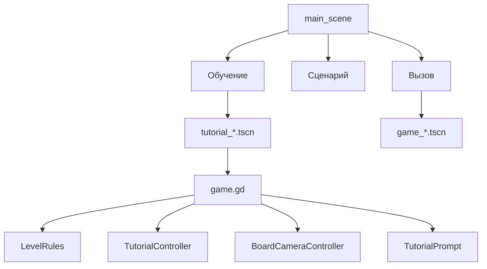

# План: Обучение и Разделы Меню

## Контекст Для Исполнителя

Проект Godot 4.x. Основная игровая логика уже собрана вокруг общей сцены `scenes/game/game.gd`. Не нужно писать отдельный рантайм для обучения: обучающие сцены должны быть обычными игровыми сценами с тем же набором узлов, но с другими `BoardFieldSetup`, `BoardModel`, `LevelRules`, `CellFlagOverlay` и новым tutorial-контроллером.

Важные существующие файлы:

- `scenes/game/game.gd` — основной оркестратор: ввод, валидация хода, запуск волны, победа, рестарт, выход в меню.
- `widgets/board/board_model.gd` — модель поля, `apply_move()`, `changed_cells`, `wave_layers`, `start_coord`.
- `widgets/board/board_view_tilemap.gd` — TileMapLayer, импорт/отрисовка поля, координаты, `map_coord_to_local_center()`, `map_coord_to_pivot()`.
- `widgets/game_transition/transition_player.gd` — проигрывание волн, уже есть сигнал `cell_wave_started(coord)`.
- `widgets/game_session/game_session_state.gd` — счётчик ходов, `turn_limit_enabled`, `max_turns`, `can_continue()`.
- `widgets/game_hud/hud_controller.gd` — HUD и прогресс-бар ходов, уже есть видимость лимита через `set_turn_limit_ui_visible()`.
- `widgets/level_rules/level_rules.gd` — новый узел преднастроек уровня, уже умеет флаги и лимит ходов.
- `widgets/cell_flag/cell_flag_overlay.gd` и `widgets/cell_flag/cell_flag_banner.gd` — флаги, их расстановка и сбивание.
- `widgets/game_input/board_camera_controller.gd` — pan/zoom и suppression клика при drag.
- `uis/game_pause_menu/game_pause_menu.gd` — pause-меню, рестарт и выход в главное меню. Кнопка меню должна оставаться доступной во всех tutorial-сценах.
- `scenes/main/main_scene.gd` и `scenes/main/main_scene.tscn` — главное меню и slide-переходы.

Ассеты подсказок уже есть:

- `assets/gifs/tap.gif`
- `assets/gifs/scale.gif`
- `assets/gifs/move.gif`

Важно: ранее Godot не грузил GIF напрямую как ресурс. Если GIF снова не импортируется как `Texture2D`/`SpriteFrames`, использовать самый простой рабочий путь: либо `AnimatedSprite2D` с извлечёнными кадрами PNG, либо временно `TextureRect`/`AnimatedTexture`, если Godot импортирует эти конкретные GIF. Не трогать `.godot/`.

## Цель

Добавить обучающий раздел с несколькими игровыми сценами:

- обучение тапу на поле 2 клетки;
- обучение перемещению и масштабированию камеры на поле 12x12;
- обучение ограничению ходов через плохой и хороший сценарий;
- обучение флагам через плохой и хороший сценарий;
- обновить главное меню на 3 раздела: «Обучение», «Сценарий», «Вызов».

Нужно сохранить обычные игровые сцены: `game_small`, `game_large`, `game_random`. Они переедут в раздел «Вызов».

## Архитектурный Подход

Использовать композицию сцены:



Не смешивать сценарные состояния tutorial прямо в `BoardModel` или `TransitionPlayer`. `game.gd` может дать tutorial-контроллеру небольшие хуки/сигналы, но правила этапов должны жить в отдельном узле.

## Этап 1: Расширить LevelRules

Файл: `widgets/level_rules/level_rules.gd`.

Добавить экспортируемые настройки:

- `enable_flags: bool`
- `enable_turn_limit: bool`
- `max_turns: int`
- `enable_taps: bool`
- `enable_pan: bool`
- `enable_zoom: bool`
- `show_turn_toolbar: bool`

Поведение:

- `enable_turn_limit = false` отключает ограничение ходов в `GameSessionState`.
- `show_turn_toolbar = false` скрывает прогресс-бар и текст ходов, даже если логика лимита включена. Это нужно на случай, если понадобится скрыть UI отдельно.
- `enable_flags = false` скрывает `CellFlagOverlay` и отключает tick/knock logic в `game.gd`.
- `enable_taps = false` запрещает выбор клетки в `game.gd`, но pause-меню должно работать.
- `enable_pan` и `enable_zoom` применяются к `BoardCameraController`.

Метод `apply(...)` лучше расширить без ломки текущих вызовов. Пример формы:

```gdscript
func apply(
    game_session: Node,
    hud_controller: Node,
    cell_flag_overlay: Node2D,
    pause_menu: Node = null,
    camera_controller: Node = null
) -> void:
```

Если какой-то аргумент `null`, просто пропускать.

## Этап 2: Ограничения Ввода

Файл: `widgets/game_input/board_camera_controller.gd`.

Добавить:

- `@export var allow_pan := true`
- `@export var allow_zoom := true`

Применение:

- колесо мыши и `InputEventMagnifyGesture` должны игнорироваться, если `allow_zoom == false`;
- `_apply_grab_pan()` или путь до неё должен игнорироваться, если `allow_pan == false`;
- отслеживание pointer travel оставить, чтобы drag не превращался в случайный tap, но фактическое движение камеры должно быть заблокировано;
- `is_suppressing_click()` пусть работает как раньше.

Файл: `scenes/game/game.gd`.

Добавить проверку `enable_taps` перед `_on_cell_selected(coord)` или внутри `_on_cell_selected`. Если тап запрещён, просто игнорировать выбор клетки без сообщения об ошибке.

## Этап 3: TutorialPrompt

Создать:

- `widgets/tutorial/tutorial_prompt.gd`
- `widgets/tutorial/tutorial_prompt.tscn`

Назначение: CanvasLayer/Control с плашкой-подложкой, текстом и опциональной GIF/анимацией.

Рекомендуемая структура:

- `TutorialPrompt` (`CanvasLayer` или `Control` на `CanvasLayer`)
- `Root` (`Control`, full rect, mouse_filter ignore)
- `PanelContainer` с `StyleBoxFlat` полупрозрачной подложкой
- `VBoxContainer`
- `TextureRect` или `AnimatedSprite2D` для подсказки
- `Label` с переносом строк и центрированием

Методы:

- `set_text(text: String) -> void`
- `set_hint_texture_or_animation(path: String) -> void`
- `show_prompt(text: String, hint_path: String = "") -> void`
- `hide_prompt() -> void`

Плашка не должна блокировать клики по полю и pause-меню. Для Control-узлов ставить `mouse_filter = MOUSE_FILTER_IGNORE`, кроме случаев, если будет отдельная кнопка.

## Этап 4: TutorialController

Создать:

- `widgets/tutorial/tutorial_controller.gd`

Он будет `extends Node`.

Экспортируемые настройки:

- `@export var tutorial_kind: TutorialKind`
- NodePath на `LevelRules`
- NodePath на `TutorialPrompt`
- опционально NodePath на `BoardModel`, `BoardView`, `GameSessionState`, если не хочется искать соседей.

Возможный enum:

```gdscript
enum TutorialKind {
    TAP,
    CAMERA,
    TURN_LIMIT,
    FLAGS
}
```

Состояние:

- `_stage: int = 0`
- `_bad_scenario_completed: bool = false`
- `_move_count_in_stage: int = 0`
- `_has_seen_loss: bool = false`

Контроллер должен уметь:

- применять этап через `LevelRules`;
- менять текст и GIF в `TutorialPrompt`;
- реагировать на ход игрока;
- реагировать на проигрыш/победу;
- перехватывать смысл рестарта в обучающих сценах 3 и 4.

Не хранить tutorial progress в `GameSettings`. Требование пользователя: если выйти в меню и открыть сцену заново, начинать с первого сценария.

## Этап 5: Хуки Из Game.gd

Файл: `scenes/game/game.gd`.

Добавить опциональный узел:

```gdscript
@onready var tutorial_controller: Node = get_node_or_null("TutorialController")
```

Добавить сигналы или прямые вызовы. Лучше сигналы, чтобы `game.gd` не знал деталей tutorial:

- `signal move_registered(move_result: Dictionary)`
- `signal wave_started_on_cell(coord: Vector2i)`
- `signal game_won(move_result: Dictionary)`
- `signal game_lost()`
- `signal session_restart_requested()`

Где эмитить:

- после `game_session_state.register_move(move_result)` и до/после `tick_after_move()` — `move_registered`;
- в `_on_cell_wave_started(coord)` — `wave_started_on_cell`;
- при solved в `_on_wave_playback_finished` — `game_won`;
- когда игрок больше не может ходить из-за лимита ходов — `game_lost`. Это можно проверять после регистрации хода, если `!move_result.get("solved", false)` и `!game_session_state.can_continue()`;
- в `_on_pause_restart_requested()` перед обычным рестартом — дать tutorial-контроллеру шанс обработать сценарный рестарт.

Для сценарного рестарта лучше добавить метод в tutorial-контроллер:

```gdscript
func handle_restart_request() -> bool:
    # true значит контроллер обработал рестарт сам или хочет продолжить особым этапом
```

В `game.gd`:

- если controller есть и `handle_restart_request()` вернул `true`, выполнить reset board/session так, как просит контроллер, либо вызвать общий restart после изменения stage;
- если вернул `false`, обычный restart.

Проще для первого прохода: `handle_restart_request()` меняет stage и возвращает `false`, а обычный `_on_pause_restart_requested()` затем перезапускает партию уже с новыми правилами.

## Этап 6: Сцена 1, Tap Tutorial

Создать:

- `scenes/tutorial/tutorial_tap.tscn`

Основа: скопировать структуру `scenes/game/game_small.tscn`, но упростить поле.

Настройки:

- `BoardModel.rows = 1`
- `BoardModel.columns = 2`
- `BoardModel.color_count` можно 2
- `BoardModel.start_coord = Vector2i(0, 0)`
- `BoardFieldSetup` либо импортирует два тайла из `BoardView`, либо bootstrap 2x1.
- `LevelRules.enable_flags = false`
- `LevelRules.enable_turn_limit = false`
- `LevelRules.show_turn_toolbar = false`
- `LevelRules.enable_taps = true`
- `LevelRules.enable_pan = false`
- `LevelRules.enable_zoom = false`

Содержимое поля:

- две клетки разных цветов, чтобы клик по соседней клетке расширял волну и быстро показывал механику.

Подсказка:

- `TutorialPrompt.show_prompt("Нажми на клетку, чтобы запустить волну преобразования.", "res://assets/gifs/tap.gif")`
- GIF/иконку расположить визуально над клеткой, которую надо нажать, если `TutorialPrompt` поддерживает overlay-position. Если нет, достаточно в плашке показать GIF и текст.

Проверить:

- drag не двигает камеру;
- zoom не работает;
- тап по клетке работает;
- pause-меню открывается.

## Этап 7: Сцена 2, Camera Tutorial

Создать:

- `scenes/tutorial/tutorial_camera.tscn`

Основа: игровая сцена 12x12.

Поле:

- 12x12 клеток;
- 4 квадратных сегмента 6x6;
- каждый сегмент одного цвета;
- цвета сегментов должны быть разные, чтобы игрок видел крупные области.

Стадии:

1. Перемещение:
   - `enable_pan = true`
   - `enable_zoom = false`
   - `enable_taps = false`
   - prompt: текст про свайп/перемещение, `move.gif`
   - переход на следующую стадию после факта drag/pan. Для этого можно добавить сигнал в `BoardCameraController`, например `panned`.

2. Масштабирование:
   - `enable_pan = false` или true, если после свайпа можно оставить pan доступным. По запросу пользователя «последовательно. Сначала только скелинг, потом масштабирование» здесь лучше сделать строго: на стадии zoom доступен только zoom.
   - `enable_zoom = true`
   - `enable_taps = false`
   - prompt: текст про масштабирование, `scale.gif`
   - переход после изменения zoom. Добавить сигнал `zoomed`.

3. Завершение уровня:
   - `enable_pan = true`
   - `enable_zoom = true`
   - `enable_taps = true`
   - prompt: «А теперь закончи уровень»
   - игрок решает поле.

Примечание по словам пользователя: он написал «скелинг» и «масштабирование», а также приложил `scale.gif` и `move.gif`. В реализации считать `move.gif` подсказкой для свайпа/pan, `scale.gif` подсказкой для pinch/zoom.

## Этап 8: Сцена 3, Turn Limit Tutorial

Создать:

- `scenes/tutorial/tutorial_turn_limit.tscn`

Идея: две фазы в одной сцене.

Плохой сценарий:

- включить лимит ходов;
- выставить поле и `max_turns` так, чтобы предлагаемый очевидный/плохой тап приводил к поражению;
- на старте ограничить доступные действия, если нужно: можно разрешить только конкретный тап через tutorial-контроллер, игнорируя остальные клетки;
- после проигрыша показать плашку: «Следи за количеством ходов и за верхним тулбаром. Если уровень зашёл в тупик, начни заново через меню.»
- отметить `_bad_scenario_completed = true`.

Рестарт после полного плохого сценария:

- если игрок нажал рестарт в pause-меню после `_bad_scenario_completed`, tutorial-контроллер переводит stage на хороший сценарий;
- обычный reset партии выполняется уже с настройками хорошего сценария.

Хороший сценарий:

- то же поле или похожее, но правильный порядок ходов укладывается в лимит;
- prompt коротко говорит попробовать другой порядок;
- после победы показывать обычный win UI или tutorial prompt с завершением.

Если игрок выйдет в главное меню и запустит сцену заново, `_bad_scenario_completed` снова false, старт с плохого сценария.

## Этап 9: Сцена 4, Flags Tutorial

Создать:

- `scenes/tutorial/tutorial_flags.tscn`

Плохой сценарий:

- `LevelRules.enable_flags = true`;
- `enable_turn_limit` можно отключить, если фокус только на флагах;
- выставить 1-2 `CellFlagBanner` вручную в `CellFlagOverlay`;
- сценарий должен привести к тому, что игрок пропускает/теряет возможность правильно сбить флаг или сбивает не вовремя;
- после завершения плохого сценария показать плашку: «Флаги нужно сбивать до того, как счётчик станет нулём. Попробуй начать заново и спланировать волну.»
- отметить `_bad_scenario_completed = true`.

Рестарт:

- после полного плохого сценария рестарт переводит на хороший сценарий;
- выход в меню сбрасывает всё.

Хороший сценарий:

- тот же принцип, но порядок ходов позволяет сбить флаг;
- подсказка может быть краткой: «Построй волну так, чтобы она прошла через флаг.»

Важно: текущая механика флагов уже делает нужное:

- число уменьшается сразу при ходе;
- сбивание запускается на `cell_wave_started(coord)`;
- depleted-флаг не сбивается.

Сцена должна только подобрать поле и флаги так, чтобы это было понятно.

## Этап 10: Главное Меню

Файлы:

- `scenes/main/main_scene.tscn`
- `scenes/main/main_scene.gd`

Текущие кнопки `SmallButton`, `LargeButton`, `RandomButton` убрать с первого экрана или переместить в «Вызов».

На первом экране оставить:

- «Обучение»
- «Сценарий»
- «Вызов»
- «Настройки»
- «Об игре»

Подменю «Обучение»:

- «1. Тап»
- «2. Камера»
- «3. Ходы»
- «4. Флаги»
- «Назад»

Подменю «Сценарий»:

- плашка «Скоро» или пустой список;
- «Назад».

Подменю «Вызов»:

- «Малое поле» -> `res://scenes/game/game_small.tscn`
- «Большое поле» -> `res://scenes/game/game_large.tscn`
- «Случайное поле» -> `res://scenes/game/game_random.tscn`
- «Назад».

Лучше не плодить отдельные tscn для простых подменю, если существующий `main_scene.gd` может создавать их программно. Но если проще и чище, можно создать `scenes/main/menu_submenu_panel.tscn` с сигналами. Главное — сохранить slide-переход через `MenuSlideTransition`.

## Этап 11: Минимальные Изменения В GameOverUI

Для tutorial 3 и 4 может понадобиться поражение, а сейчас `GameOverUI` выглядит как экран победы.

Варианты:

- быстрый: tutorial-контроллер показывает свой `TutorialPrompt` при поражении, а `GameOverUI` не используется;
- более аккуратный: расширить `GameOverUI` методами `present_win(turns)` и `present_message(title, body)`.

Рекомендуется быстрый вариант для меньшего diff: поражение в tutorial показывать `TutorialPrompt`, обычный `GameOverUI` оставить для победы.

## Этап 12: Порядок Реализации

1. Расширить `LevelRules` и `BoardCameraController`.
2. Добавить хуки/сигналы в `game.gd`, не меняя поведение обычных сцен.
3. Создать `TutorialPrompt`.
4. Создать базовый `TutorialController` с `TutorialKind.TAP` и проверить первую сцену.
5. Добавить camera tutorial, включая сигналы `panned`/`zoomed` в `BoardCameraController`.
6. Добавить turn-limit tutorial.
7. Добавить flags tutorial.
8. Переделать главное меню.
9. Прогнать проверки.

## Проверка

Headless:

- загрузить каждую новую сцену через Godot `--headless --script` или аналогичный проектный smoke script;
- убедиться, что нет parse errors;
- проверить, что старые `game_small`, `game_large`, `game_random` всё ещё грузятся.

Ручная проверка:

- Tutorial tap: камера не двигается, zoom не работает, тап работает, меню работает.
- Tutorial camera: сначала работает только pan, потом только zoom, потом pan/zoom/tap.
- Tutorial turns: плохой сценарий приводит к объяснению; рестарт после этого переводит на хороший; выход в меню сбрасывает сцену.
- Tutorial flags: плохой сценарий объясняет флаги; рестарт после этого переводит на хороший; depleted-флаг ведёт себя как раньше.
- Main menu: «Обучение», «Сценарий», «Вызов», настройки, об игре; все back-переходы работают.

## Риски И Подсказки

- Не менять `.godot/`.
- Не добавлять зависимости.
- Сцены обучения лучше держать в `scenes/tutorial/`, новые виджеты в `widgets/tutorial/`.
- Если GIF не импортируются, не тратить много времени на GIF loader: использовать кадры или простой `AnimatedSprite2D` с подготовленными ресурсами.
- Не ломать обычный режим: все новые tutorial-хуки должны быть опциональными, если `TutorialController` отсутствует.
- Если `LevelRules` отсутствует в старой/тестовой сцене, `game.gd` должен иметь безопасные дефолты: флаги включены, лимит ходов включён, pan/zoom/taps включены.