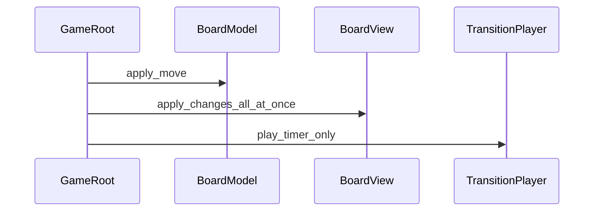
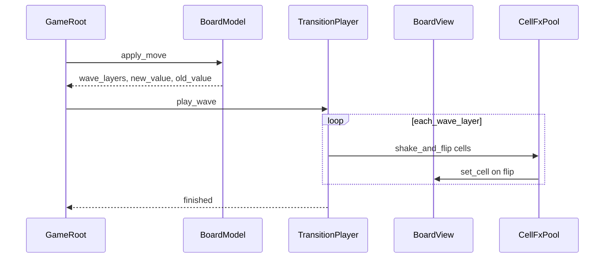

# План: волновая анимация смены тайлов

## Цель

При ходе Flood It визуально проигрывать волну от `BoardModel.start_coord`: слой за слоем (4-связный BFS, как заливка) — лёгкая тряска → сильная тряска → смена типа тайла → burst частиц. Логика поля обновляется сразу; `TileMapLayer` и FX — по таймлайну.

## Текущая проблема

В [`game_root.gd`](scenes/game_composed/game_root.gd) после хода сразу вызывается `board_view.apply_changes(changed_cells)`, а [`transition_player.gd`](scenes/game_composed/transition_player.gd) только ждёт таймер — волны нет.



Целевой поток:



## 1) Расширить контракт `BoardModel.apply_move`

Файл: [`scenes/game_composed/board_model.gd`](scenes/game_composed/board_model.gd)

- Переписать BFS так, чтобы собирать **`wave_layers: Array`** — каждый элемент массива = `Array[Vector2i]` клеток одного «кольца» от `start_coord`.
- Алгоритм: очередь по уровням (обработка текущего слоя целиком, затем следующий), соседи через существующий `get_neighbors()` (4 направления).
- В `MoveResult` добавить поля:
  - `wave_layers`
  - `new_value` (целевой цвет)
  - `old_value` (цвет до заливки)
  - сохранить `changed_cells`, `applied`, `reason`, `solved`
- Данные `cells` по-прежнему обновляются сразу в `apply_move` (валидатор и solved остаются корректными).

## 2) API отображения в `BoardView`

Файл: [`scenes/game_composed/board_view_tilemap.gd`](scenes/game_composed/board_view_tilemap.gd)

Добавить методы (без логики хода):

| Метод | Назначение |
|-------|------------|
| `map_coord_to_local_center(coord)` | позиция центра клетки в локальных координатах `BoardView` (учёт `scale` родителя) |
| `get_texture_for_value(value: int)` | текстура из `tile_set` по `color_to_source_id` / atlas |
| `render_coord_value(coord, value)` | явная отрисовка клетки заданным значением (для flip на `new_value`) |
| `erase_coord(coord)` | убрать тайл (опционально на время FX, если нужно скрыть «старый» тайл под оверлеем) |

`apply_changes` оставить для полного рефреша / editor preview; волна использует `render_coord_value` точечно.

## 3) Новый виджет `CellFx` + пул

Новые файлы в `widgets/cell_fx/` (переиспользуемый компонент по архитектуре проекта):

- `cell_fx.tscn` — `Node2D` + `Sprite2D` + `GPUParticles2D` (one-shot, `emitting = false` по умолчанию)
- `cell_fx.gd` — метод `play_flip(old_tex, new_tex, on_flipped: Callable)`:
  1. показать спрайт со старым типом
  2. tween: лёгкая тряска (~0.08 с, offset ±2 px в локальных координатах)
  3. tween: сильная тряска (~0.10 с, ±5 px, лёгкий scale)
  4. смена `texture` на новый, вызов `on_flipped` (там `BoardView.render_coord_value`)
  5. burst частиц (~0.15–0.2 с), скрыть спрайт, `finished` сигнал

Пул: `cell_fx_pool.gd` + нода `CellFxPool` (`Node2D`) в [`game_composed.tscn`](scenes/game_composed/game_composed.tscn) как дочерний узел `BoardView` (тот же transform/scale).

- Предсоздать N экземпляров (например 32–64), `acquire()` / `release()`.
- Параллельно в одном слое волны — все клетки слоя стартуют с одной задержкой `wave_index * wave_delay`.

## 4) Переписать `TransitionPlayer`

Файл: [`scenes/game_composed/transition_player.gd`](scenes/game_composed/transition_player.gd)

Заменить `play(changed_cells)` на:

```gdscript
func play_wave(move_result: Dictionary, board_view: TileMapLayer, fx_pool: Node) -> void
```

`@export` тюнинг (инспектор):

- `wave_delay_sec` — пауза между слоями (~0.05)
- `shake_light_sec`, `shake_strong_sec`
- `particle_enabled` — для отладки

Логика:

1. `started.emit()`
2. для каждого слоя в `wave_layers`: `await` delay → запустить `CellFx` для всех координат слоя
3. `await` завершения всех FX слоя (через счётчик / `Promise`-паттерн на сигналах)
4. `finished.emit()`

Старый `play()` можно удалить или оставить thin-wrapper для совместимости.

## 5) Изменить `GameRoot`

Файл: [`scenes/game_composed/game_root.gd`](scenes/game_composed/game_root.gd)

- Убрать немедленный `board_view.apply_changes(changed_cells)` после хода.
- Перед анимацией (опционально): для всех `changed_cells` оставить на карте **старый** вид до flip — либо не трогать tilemap (клетки ещё показывают старый source, т.к. модель уже новая — **важно**): перед `apply_move` сохранить snapshot `old_values` по coords ИЛИ отрисовать старые тайлы из `move_result.old_value` до старта волны.

  **Рекомендуемый вариант:** в `apply_move` до мутации собрать `changed_cells` с BFS, но визуально в `GameRoot` сразу после хода вызвать `board_view.render_coords_with_value(changed_cells, old_value)`, затем `transition_player.play_wave(...)`.

- Передать в `TransitionPlayer` ссылки: `board_view`, `CellFxPool`.
- Фаза `ANIMATING` / блокировка input — без изменений.

## 6) Сцена `game_composed.tscn`

- Добавить `CellFxPool` под `BoardView`.
- Прописать `NodePath` в `TransitionPlayer` / `GameRoot` при необходимости.
- Настроить базовый пресет частиц (короткий burst, 4–8 частиц, fade out; цвет — modulate спрайта нового типа).

## 7) Производительность (задел на большие карты)

- Анимация идёт **по слоям BFS**, не по одному глобальному таймеру на каждую клетку вручную.
- Пул ограничивает число одновременных `Node`.
- Если в слое > pool size — очередь внутри `CellFxPool` (второй инкремент; в MVP достаточно pool 64 для поля 9×6).

## 8) Проверка (ручной smoke)

1. Валидный ход — волна от угла, тайлы меняются слоями.
2. `NO_OP_MOVE` — анимация не стартует.
3. Клики блокируются на время `ANIMATING`.
4. После `finished` состояние `TileMapLayer` совпадает с `BoardModel`.
5. Масштаб `BoardView` (~9.83) — FX в локальных координатах `BoardView`, позиции совпадают с клетками.

## Файлы

| Действие | Путь |
|----------|------|
| Изменить | [`scenes/game_composed/board_model.gd`](scenes/game_composed/board_model.gd) |
| Изменить | [`scenes/game_composed/board_view_tilemap.gd`](scenes/game_composed/board_view_tilemap.gd) |
| Изменить | [`scenes/game_composed/transition_player.gd`](scenes/game_composed/transition_player.gd) |
| Изменить | [`scenes/game_composed/game_root.gd`](scenes/game_composed/game_root.gd) |
| Изменить | [`scenes/game_composed/game_composed.tscn`](scenes/game_composed/game_composed.tscn) |
| Создать | `widgets/cell_fx/cell_fx.tscn`, `cell_fx.gd` |
| Создать | `widgets/cell_fx/cell_fx_pool.gd` |

Старую сцену [`scenes/game`](scenes/game) не трогаем.
